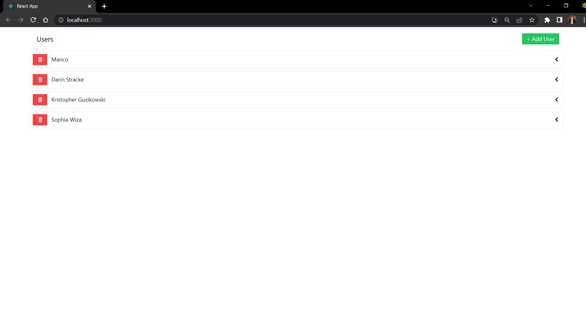
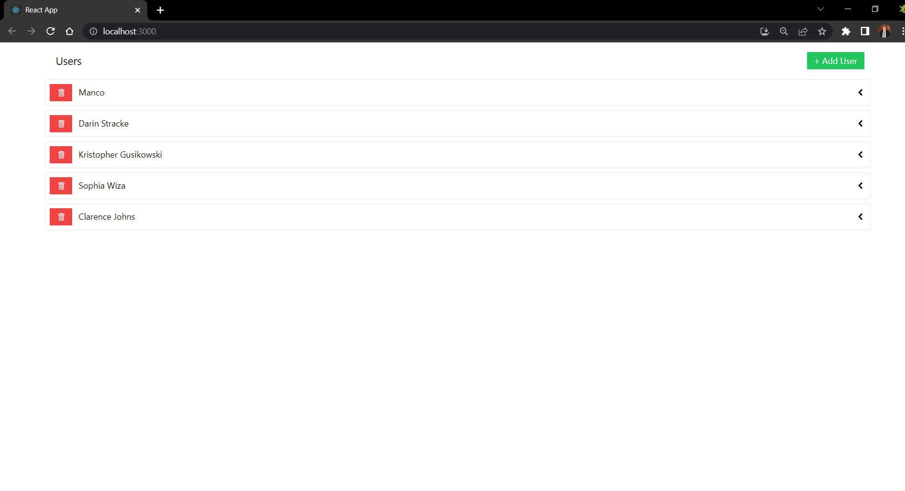
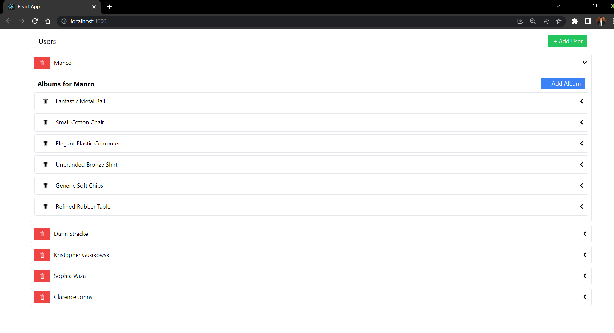
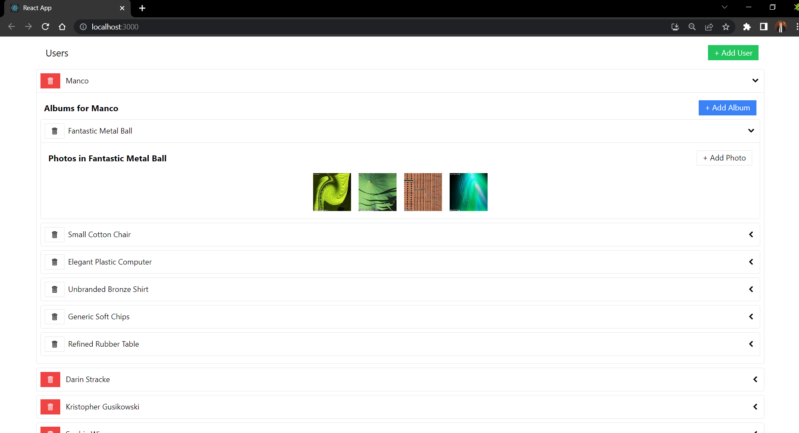
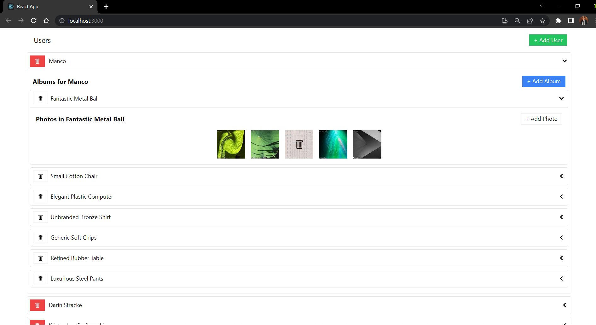
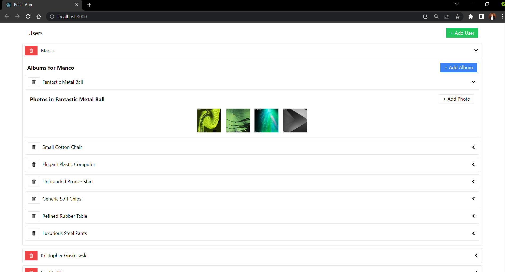

# Media-For-Users-With-Albums-And-Photos
In this application we can fetch, add and remove users and album for each user and photos for each album using React, redux toolkit, redux toolkit query

